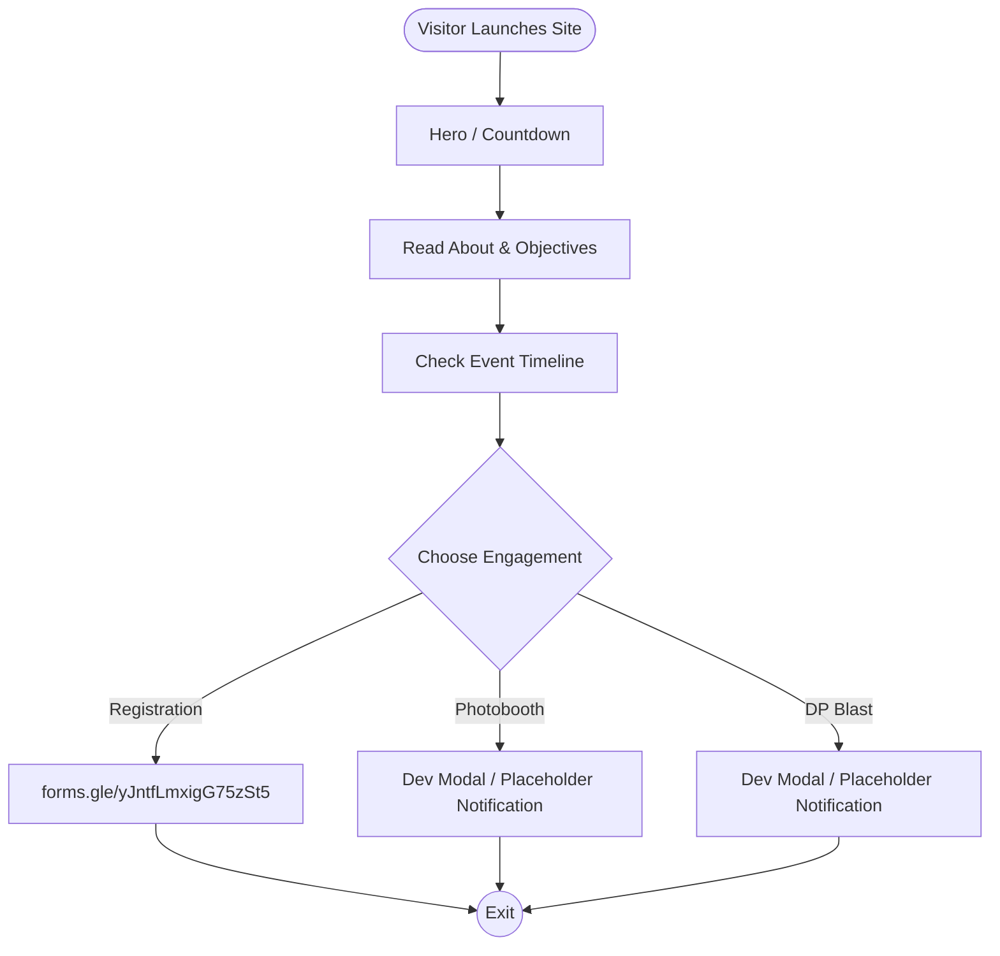

# Product Requirements Document (PRD)

**Project:** SparkFest 2026 Landing Page
**Date:** 2026-06-07
**Version:** 0.1
**Owner:** GDG PUP Manila
**Status:** Draft
**Last reconciled:** N/A - first draft
**BRD:** N/A

---

## 1. Product Purpose & Value Proposition

SparkFest 2026 is a flagship hackathon organized by Google Developer Groups on Campus Polytechnic University of the Philippines (GDG PUP). This immersive innovation challenge mirrors real-world startup environments, bringing together students from diverse technical, creative, and managerial backgrounds. 

The SparkFest 2026 Website is a 1-page static marketing website designed to capture student registrations, display event timeline/information, and provide direct routes to interactive event features (GDG Photobooth and DP Blast). The design is clean, minimal, and optimized for speed and conversion without overwhelming the visitor.

---

## 2. Target Personas

**Primary Persona — The Student Participant**
- *Who they are:* Developers, designers, managers, and tech enthusiasts looking for hands-on hackathon experience.
- *Their core frustration:* Hard to find interdisciplinary teammates and start-up simulation environments that bridge technical skills with community impact.
- *What success looks like for them:* Simple registration process, clear visual timeline of milestones, and easy access to secondary tools (Photobooth, DP Blast).

---

## 3. Core Features & Priorities

| ID | Feature | Description | Priority |
|----|---------|-------------|----------|
| PRD-F1 | Hero & Main CTA | Introduction header, theme, dates, and primary registration button with a countdown to the event start (June 28, 2026). | Must-Have |
| PRD-F2 | Event Overview | Clear details about the event, rationale, objectives, venue, and eligibility rules. | Must-Have |
| PRD-F3 | Visual Timeline | Layout mapping event phases from promotions (June 1) through the final pitches/awards (July 9). | Must-Have |
| PRD-F4 | Photobooth Redirection | Button directing user to the GDG Photobooth. Since URL is pending, it shows a developer warning/modal notification. | Must-Have |
| PRD-F5 | DP Blast Redirection | Button directing user to the DP Blast generator. Since URL is pending, it shows a developer warning/modal notification. | Must-Have |
| PRD-F6 | Dynamic Responsive Layout | Perfect readability on screens from 375px (mobile-first) to large desktop viewports. | Must-Have |

---

## 4. User Stories & Acceptance Criteria

**US-01 — Registration & Countdown**
> As a prospective participant, I want to see a countdown to the event and click a registration CTA to join.

Acceptance Criteria:
- Given the event date is set to June 28, 2026, the countdown component must display remaining Days, Hours, Minutes, and Seconds.
- When the registration button is clicked, it redirects the user to `https://forms.gle/yJntfLmxigG75zSt5` in a new tab.

**US-02 — Interactive Placeholders**
> As a developer or early user, I want to click Photobooth or DP Blast and receive a notification that it's a placeholder.

Acceptance Criteria:
- Given the Photobooth and DP Blast URLs are placeholders, when clicked, they display a toast notification or stylized inline notice informing the user that the redirection is pending and prompting developers to update the links.

---

## 5. App Flow & UX Intent

**Design reference:** [dsd-sparkfest.md](dsd-sparkfest.md)

### 5.1 Screen Inventory

This is a single-page marketing website.

| Section | Purpose | States to design |
|--------|---------|------------------|
| Hero / Header | Captures attention, shows event title, dates, countdown, and main CTA. | Standard rendering |
| About & Details | Explains About the Event, Rationale, and Objectives. | Standard rendering |
| Grid: Venue & Eligibility | Highlights Bulwagang Bonifacio venue details and who can participate. | Standard rendering |
| Timeline | Interactive or structured grid schedule tracking activities. | Hover/highlight state on active/upcoming timeline nodes |
| Engagement Center | Sections containing CTAs for GDG Photobooth and DP Blast. | Interactivity warning prompts |

### 5.2 App Flow

---

## 6. Out of Scope for This Release

- Authentication or participant login dashboards.
- Native image processing for DP Blast directly on the website (offloaded to separate app).
- Live photobooth camera features directly on the website (offloaded to separate app).

---

## 7. AI / Agent Feature Specifications

This project does not contain any native AI features.

---

## 8. Dependencies & Assumptions

**Dependencies:**
- Direct dependency on Google Fonts API for loading the `Google Sans` (and fallback sans-serif) fonts.
- External redirect targets for Registration Form (Google Forms).

**Assumptions:**
- Static deployment via Cloudflare Pages is target.
- Users access primarily from modern mobile and desktop web browsers.

---

## 9. Implementation Plan

| # | Phase / Milestone | Entry criteria | Exit criteria (Definition of Done) | Deliverable | Depends on | Owner (DRI) | Top risk |
|---|-------------------|----------------|-------------------------------------|-------------|------------|-------------|----------|
| M1 | FMD specifications locked | Initial specs drafted | Approved PRD, DSD, SDD | Approved FMD suite in `docs/` | — | GDG PUP Manila | Incomplete styling rules |
| M2 | Style primitive setup | DSD approved | Tailwind variables and layout config matching DSD | Configured `globals.css` and `layout.tsx` | M1 | GDG PUP Manila | Typography rendering mismatch |
| M3 | Page assembly | Style config ready | Entire page rendered with placeholders and interactive countdown | Complete code in `page.tsx` | M2 | GDG PUP Manila | Responsive breakdown issues |
| M4 | Build & Export | Code complete | Static export builds without errors on Cloudflare target | Successful build test | M3 | GDG PUP Manila | Tailwind Postcss v4 build issues |

**Rollout strategy:** Big-Bang rollout to Cloudflare Pages.

**Rollback plan:**
- *Trigger criteria:* Critical build failure or broken redirection flow.
- *Revert mechanism:* Redepoly the previous Git version tag on Cloudflare.
