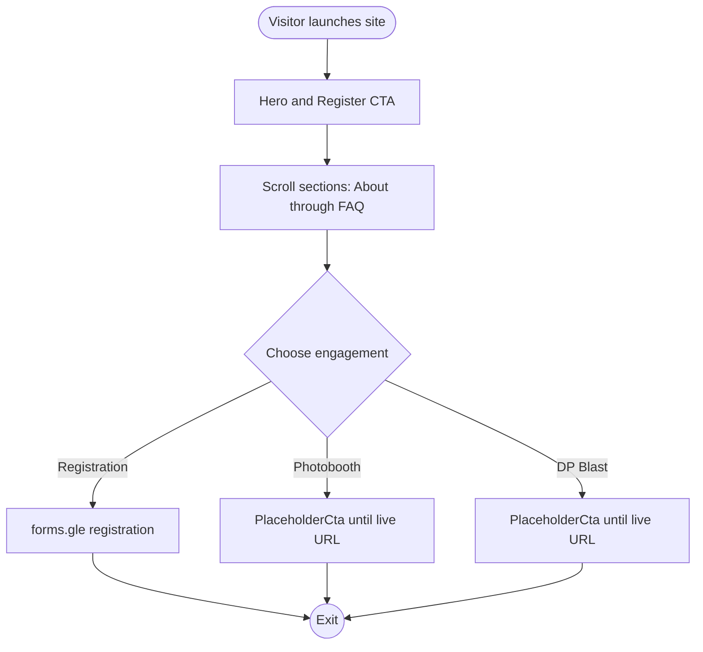

# Product Requirements Document (PRD)

**Project:** SparkFest 2026 Landing Page
**Date:** 2026-09-02
**Version:** 0.2
**Owner:** GDG PUP Technology (incoming CTO)
**Status:** Draft
**Last reconciled:** 2026-09-02 — against shipped `src/app/page.tsx` and `content.ts`
**BRD:** N/A

---

## 1. Product Purpose & Value Proposition

SparkFest 2026 is a flagship hackathon organized by Google Developer Groups on Campus Polytechnic University of the Philippines (GDG PUP). This immersive innovation challenge mirrors real-world startup environments, bringing together students from diverse technical, creative, and managerial backgrounds.

The SparkFest 2026 Website is a 1-page static marketing site (retro pixel-arcade theme) that captures registrations via Google Forms, explains the event, shows the roadmap, and routes visitors toward Photobooth and DP Blast when those URLs are live. Live site: https://sparkfest.gdgpup.org.

---

## 2. Target Personas

**Primary Persona — The Student Participant**
- *Who they are:* Developers, designers, managers, and tech enthusiasts looking for hands-on hackathon experience.
- *Their core frustration:* Hard to find interdisciplinary teammates and start-up simulation environments that bridge technical skills with community impact.
- *What success looks like for them:* Simple registration process, clear visual timeline of milestones, and easy access to secondary tools (Photobooth, DP Blast).

---

## 3. Core Features & Priorities

| ID | Feature | Description | Priority |
|----|---------|-------------|----------|
| PRD-F1 | Hero & Main CTA | Introduction header, theme, dates, and primary registration button. A live Days/Hours/Minutes/Seconds countdown was the original Must-Have; the shipped Hero is a baked Figma scene plus Register CTA (countdown deferred unless product restores it). | Must-Have |
| PRD-F2 | Event Overview | Clear details about the event, rationale, objectives, venue, and eligibility rules. | Must-Have |
| PRD-F3 | Visual Timeline | Layout mapping event phases from promotions (June 1) through the final pitches/awards (July 9). | Must-Have |
| PRD-F4 | Photobooth Redirection | Button directing user to the GDG Photobooth. Since URL is pending, it shows a developer warning/modal notification. | Must-Have |
| PRD-F5 | DP Blast Redirection | Button directing user to the DP Blast generator. Since URL is pending, it shows a developer warning/modal notification. | Must-Have |
| PRD-F6 | Dynamic Responsive Layout | Perfect readability on screens from 375px (mobile-first) to large desktop viewports. | Must-Have |

---

## 4. User Stories & Acceptance Criteria

**US-01 — Registration (countdown deferred)**
> As a prospective participant, I want a clear registration CTA on the Hero so I can join.

Acceptance Criteria:
- When the registration button is clicked, it redirects to `https://forms.gle/yJntfLmxigG75zSt5` in a new tab (`REGISTER_URL` in `content.ts`).
- Optional / deferred: a live countdown to Kick-Off (June 28, 2026). Not present in the current Hero implementation; restoring it is a product call, not silent scope creep.

**US-02 — Interactive Placeholders**
> As a developer or early user, I want to click Photobooth or DP Blast and receive a notification that it's a placeholder.

Acceptance Criteria:
- Given the Photobooth and DP Blast URLs are placeholders, when clicked, they display a toast notification or stylized inline notice informing the user that the redirection is pending and prompting developers to update the links.

---

## 5. App Flow & UX Intent

**Design reference:** [dsd-sparkfest.md](dsd-sparkfest.md)

### 5.1 Screen Inventory

Single-page marketing site. Sections match `src/app/page.tsx`:

| Section | Component | Purpose |
|--------|-----------|---------|
| Nav | `Nav.tsx` | In-page anchors |
| Hero | `Hero.tsx` + `HeroLightning.tsx` | Scene, Register CTA |
| About | `About.tsx` | Event story, stats, partners |
| What Goes Down | `WhatGoesDown.tsx` | Activity cards |
| Who Is This For | `WhoIsThisFor.tsx` | Personas |
| Judges | `Judges.tsx` | Currently TBA placeholders in `content.ts` |
| Road To Demo | `RoadToDemo.tsx` | Visual roadmap / milestones |
| Where And When | `WhereAndWhen.tsx` | Venue and schedule |
| FAQ | `Faq.tsx` | Accordion FAQs |
| Snap And Frame | `SnapAndFrame.tsx` | Photobooth + DP Blast (PlaceholderCta) |
| Before The Spark | `BeforeTheSpark.tsx` | Pre-events |
| Final CTA | `FinalCta.tsx` | Closing registration push |
| Footer | `Footer.tsx` | Links and chapter credits |
| Theme loading | `ThemeLoadingScreen.tsx` | Initial load overlay |

### 5.2 App Flow

```mermaid
flowchart TD
    User([Visitor launches site]) --> Hero[Hero and Register CTA]
    Hero --> Explore[Scroll sections: About through FAQ]
    Explore --> CTAs{Choose engagement}
    CTAs -->|Registration| GoogleForm[forms.gle registration]
    CTAs -->|Photobooth| PhotoPrompt[PlaceholderCta until live URL]
    CTAs -->|DP Blast| DpPrompt[PlaceholderCta until live URL]
    GoogleForm --> Exit((Exit))
    PhotoPrompt --> Exit
    DpPrompt --> Exit
```

---

## 6. Out of Scope for This Release

- Authentication or participant login dashboards.
- Native image processing for DP Blast directly on the website (offloaded to separate app).
- Live photobooth camera features directly on the website (offloaded to separate app).

---

## 7. AI / Agent Feature Specifications

This project does not contain any native AI features.

---

## 8. Dependencies & Assumptions

**Dependencies:**
- Direct dependency on Google Fonts API for loading the `Google Sans` (and fallback sans-serif) fonts.
- External redirect targets for Registration Form (Google Forms).

**Assumptions:**
- Static deployment via Cloudflare Pages is target.
- Users access primarily from modern mobile and desktop web browsers.

---

## 9. Implementation Plan

| # | Phase / Milestone | Entry criteria | Exit criteria (Definition of Done) | Deliverable | Depends on | Owner (DRI) | Top risk |
|---|-------------------|----------------|-------------------------------------|-------------|------------|-------------|----------|
| M1 | FMD specifications locked | Initial specs drafted | Approved PRD, DSD, SDD | Approved FMD suite in `docs/` | — | GDG PUP Manila | Incomplete styling rules |
| M2 | Style primitive setup | DSD approved | Tailwind variables and layout config matching DSD | Configured `globals.css` and `layout.tsx` | M1 | GDG PUP Manila | Typography rendering mismatch |
| M3 | Page assembly | Style config ready | Entire page rendered with placeholders and interactive countdown | Complete code in `page.tsx` | M2 | GDG PUP Manila | Responsive breakdown issues |
| M4 | Build & Export | Code complete | Static export builds without errors on Cloudflare target | Successful build test | M3 | GDG PUP Manila | Tailwind Postcss v4 build issues |

**Rollout strategy:** Big-Bang rollout to Cloudflare Pages.

**Rollback plan:**
- *Trigger criteria:* Critical build failure or broken redirection flow.
- *Revert mechanism:* Redepoly the previous Git version tag on Cloudflare.
