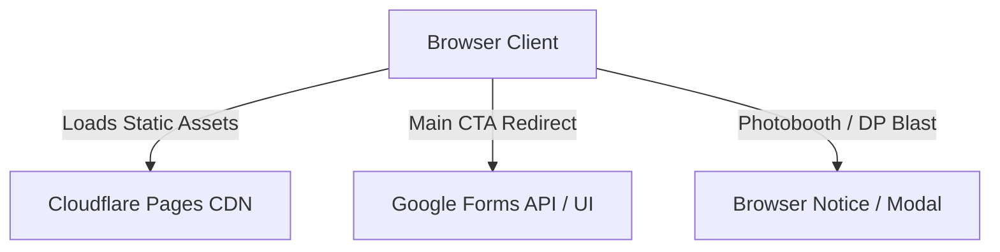

# System Design Document (SDD)

**Project:** SparkFest 2026 Website System
**Date:** 2026-06-07
**Version:** 0.1
**Owner:** GDG PUP Manila
**Status:** Draft
**Last reconciled:** N/A - first draft
**PRD:** [prd-sparkfest.md](prd-sparkfest.md)

---

## 1. Architectural Vision & Principles

**Architecture style:** Jamstack Static Web Application (Next.js 16 Static Export, React 19).

**Guiding principles:**
- **Static First:** Maximized load speeds and 100% caching via Cloudflare CDN.
- **Responsive Layout:** Mobile-first viewport sizing (375px primary focus, scaling fluidly up to desktop wide viewports).
- **Interactive Developer Notices:** Placeholder CTAs triggers interactive client-side developer feedback to aid debugging.

**Key trade-offs made:**
- **Client-Side Countdown:** Calculation of countdown is performed client-side using React state. This avoids server render mismatches (hydration errors) by executing the countdown clock only after initial hydration.
- **No Database:** Registration is offloaded to a standard Google Form to keep operational complexity and costs at zero.

---

## 2. High-Level Architecture

### Stack Components

| Layer | Technology | Responsibility |
|-------|------------|----------------|
| Client | Next.js 16 + React 19 | Static UI composition & routing |
| Styling | Tailwind CSS v4 | Class utility styling and design tokens |
| Build Tool | PostCSS + Next build compiler | Compiles static files |
| Hosting | Cloudflare Pages | Serves HTML/JS/CSS assets with global CDN caching |

---

## 3. Data Architecture

The project has no server database. All variables are static or managed client-side in the React component states.

### Client-Side State

- **Countdown State:** Tracks `days`, `hours`, `minutes`, and `seconds` dynamically on a tick interval.
- **Dev Notification State:** Tracks whether the Photobooth or DP Blast placeholder dialog/notice is visible.

---

## 4. API Design & External Integrations

### Outbound Redirects

All links open in separate tabs with standard security references (`target="_blank" rel="noopener noreferrer"`).

| Identifier | CTA | Direct Destination | Fallback / Behavior |
|------------|-----|--------------------|---------------------|
| Registration | Register Now | `https://forms.gle/RvTz12mqGWmVX9mn8` | Active immediately. |
| Photobooth | Open Photobooth | `#` | Triggers warning prompt indicating link is pending. |
| DP Blast | Generate DP Blast | `#` | Triggers warning prompt indicating link is pending. |

---

## 5. Security & Authorization

- **Static Security:** No API keys are embedded or exposed client-side.
- **Referrer Policy:** CTA links specify `rel="noopener noreferrer"` to protect referrer headers.

---

## 6. Infrastructure, CI/CD & Deployment

**Hosting:** Cloudflare Pages.

### Build Configuration

To deploy statically to Cloudflare Pages, `next.config.ts` must export static content.

- Build Command: `npm run build`
- Output Directory: `out`
- Config setting: `output: 'export'` added to NextConfig.

### Deployment Environment

- `production`: Deployed via Cloudflare Pages connected to `main` branch.
- `preview`: Automated Cloudflare Pages build on Pull Request creation.

---

## 7. Non-Functional Requirements

| Requirement | Target | Notes |
|-------------|--------|-------|
| First Contentful Paint | <1.0s | Achieved via static export and lack of database hydration blocks. |
| Accessibility (a11y) Contrast | WCAG AA compliant | Contrast ratios checked using Tailwind v4 base color definitions. |
| Mobile Viewport Support | Fluid starting at 375px | Mobile-first breakpoint alignment. |
